<br></br>
<br></br>
<br></br>
<br></br>

<div>
  <hr>
    <div style='text-align: center'>
      <b>
        <p style='font-size: 30px'>Teenplay AI 추천 모임 서비스</p> 
      </b>
      <span style='font-size: 25px'>AI 추천 모델 개발 보고서</span>
    </div>
  <hr>
    <div style='text-align: center'>
      <br></br>
      <br></br>
      <br></br>
      <br></br>
      <br></br>
      <br></br>
      <br></br>
      <span style='font-size: 25px'>2024. 05. 22.</span>
      <br></br>
      <br></br>
      <br></br>
      <br></br>
      
      <!-- <span style='font-size: 20px'>Teenplay - 송서경</span> -->
    </div>
</div>

<br></br>
<br></br>
<br></br>
<hr>
<br></br>
<br></br>
<br></br>

<h1> □ 목차</h1>
<div>
    <a style="color: inherit;" href='#Ⅰ. 개요'>
      <p style='font-size: 23px'>Ⅰ. 개요</p> <br>
    </a>
    <p style='font-size: 20px; margin-left: 20px; margin-top: -30px;'>1. 서비스 소개</p>
    <p style='font-size: 20px; margin-left: 20px;'>2. 기획배경 </p>
    <p style='font-size: 20px; margin-left: 20px;'>3. 기대효과 </p>
    <p style='font-size: 20px; margin-left: 20px;'>4. AI 추천 서비스 모델 기획 </p>
    <p style='font-size: 20px; margin-left: 20px;'>5. Flowchart </p>
    <br></br>
    <a style="color: inherit;" href='#Ⅱ. 모델 개발'>
      <p style='font-size: 23px'>Ⅱ. 모델 개발</p> <br>
    </a>
      <p style='font-size: 20px; margin-left: 20px; margin-top: -30px;'>1. 데이터 준비</p>
    <p style='font-size: 20px; margin-left: 20px;'>2. 모델 개발 및 평가</p>
    <br></br>
    <a style="color: inherit;" href='#Ⅲ. 결과'>
      <p style='font-size: 23px'>Ⅲ. 결과</p> <br>
    </a>
    <p style='font-size: 20px; margin-left: 20px; margin-top: -30px;'>1. 개발 결과</p>
</div>

<br></br>
<br></br>
<br></br>
<br></br>
<br></br>

<h1 id="Ⅰ. 개요">Ⅰ. 개요</h1>

# 1. 서비스 소개
○ 사용자의 지역, 관심 분야, 관심 키워드를 분석하여 사용자에게 맞는 모임을 추천하는 AI 서비스

<br></br>
<br></br>

# 2. 기획배경
○ 회원 맞춤형 추천의 필요성
- 사용자가 자신에게 맞는 모임을 보다 쉽게 탐색하고 참여할 수 있도록 사용자의 지역, 관심 분야 등을 고려한 맞춤형 추천 시스템의 필요성

<br></br>

○ 커뮤니티 활성화 도모
- 커뮤니티의 활성화를 위해 사용자의 모임 가입을 유도하는 맞춤형 추천 시스템의 필요성

<br></br>
<br></br>

# 3. 기대효과
○ 모임 탐색의 피로도 감소
- 사용자의 지역 및 관심도를 고려하여 추천 시스템이 사용자에게 알맞는 모임을 추천하므로 사용자는 모임에 대한 정보를 쉽게 탐색할 수 있고 탐색의 피로도가 감소됨

<br></br>

○ 각 모임의 참여율 증대
- 사용자 별 관심사에 맞는 추천을 통해 모임의 참여율 증가를 기대할 수 있음

<br></br>

○ 정교화된 맞춤형 서비스 제공
- 추천 시스템을 기반으로 수집된 데이터를 통해 사용자에게 정교화된 맞춤형 서비스를 제공하므로 사용자의 만족도를 향상할 수 있음

<br></br>
<br></br>

# 4. AI 추천 서비스 모델 기획
○ 모델 종류: 사전 훈련 모델, 회원 별 모델 

<br></br>

○ 사전 훈련 모델: AI 추천을 위해 특정 정보로 사전에 학습된 모델
- 시즌에 맞는 특정 카테고리 및 키워드를 입력하면, 입력된 내용과 모임 정보의 유사도를 분석하여 모임의 카테고리(분류)를 예측할 수 있게함
- 사용자가 모임 상세 페이지에 접속할 시 해당 모임의 정보를 가지고 회원 별 모델의 추가 학습을 진행함

| 연번 | 테이블      | 정보                                          |
|----|----------|---------------------------------------------|
| 1  | tbl_club | 모임 이름 (club_name)                           |
| 2  | tbl_club | 모임 소개 (club_intro)                          |
| 3  | tbl_club | 모임 정보 (club_info)                           |
| 4  | tbl_club | 모임 활동 지역 (club_region_id)                   |
| 5  | tbl_club | 모임 카테고리/분류 (club_main_category_id) (target) |

<br></br>

○ 회원 정보
- 사용자의 정보와 모델의 유사도를 분석하여 사용자가 선호하는 모임을 예측하여 추천할 수 있게 함

| 연번 | 테이블                          | 정보                           |
|----|------------------------------|------------------------------|
| 1  | tbl_member                   | 회원 주소 (member_address)       |
| 2  | tbl_member                   | 회원 관심 키워드1 (member_keyword1) |
| 3  | tbl_member                   | 회원 관심 키워드2 (member_keyword2) |
| 4  | tbl_member                   | 회원 관심 키워드3 (member_keyword3) |
| 5  | tbl_member_favorite_category | 회원 관심 카테고리/분류 (category_id)  |

<br></br>
<br></br>

# 5. Flowchart
- 회원 로그인 여부에 따라 필요한 데이터 정보를 전달 받아 메인 페이지에서 모임 추천을 진행
- 섹션에서 회원 정보 존재 여부에 따라 데이터를 응답받고 사용되는 모델이 상이함  
<sub>비회원: 사전 훈련 모델, 회원: 회원 별 모델</sub>

<br></br>

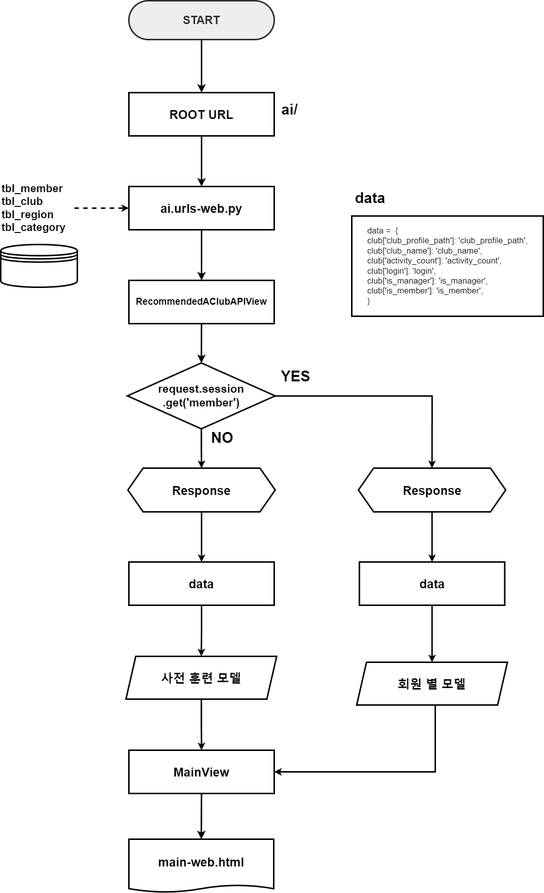

<br></br>
<br></br>
<br></br>
<br></br>
<br></br>

<h1 id="Ⅱ. 모델 개발">Ⅱ. 모델 개발</h1>

# 1. 데이터 수집
## □ 데이터 수집
- 사전 훈련 모델 학습을 위하여 ```selenium(셀레니움)``` 라이브러리를 통해 * web crawling(웹 크롤링)으로 모임 데이터를 수집함  
<sub>* web crawling이란, 인터넷 주소(URL)에 접근하여 해당 주소에 있는 정보들을 자동으로 추출할 수 있는 기술인 스크래핑으로 데이터를 추출하여 복사함</sub>

<details>
  <summary>code</summary>

  ```
  # 무한 스크롤 크롤링
  from webdriver_manager.chrome import ChromeDriverManager
  from selenium import webdriver
  from selenium.webdriver.common.by import By
  from selenium.webdriver.chrome.service import Service
  import time
  from selenium.webdriver.common.keys import Keys
  import csv

  # Crome 에 대한 최신 버젼을 가져와서 웹 페이지를 가져와서 랜더링을 한다.
  chrome_options = webdriver.ChromeOptions()
  driver = webdriver.Chrome(service=Service(ChromeDriverManager().install()), options=chrome_options)

  driver.get(url='{사이트 주소}')

  # 무한스크롤 동적 클롤링

  # 페이지 스크롤링
  for i in range(0, 20):
      driver.find_element(By.TAG_NAME, 'body').send_keys(Keys.PAGE_DOWN)
      time.sleep(1)  # 스크롤 사이에 대기 시간 추가

  titles = driver.find_elements(By.CSS_SELECTOR, '.{클래스명}')
  print(titles)

  # CSV 파일로 저장
  csv_file_path = '{저장 경로\\파일명.csv}'
  with open(csv_file_path, mode='w', newline='', encoding='utf-8-sig') as file:
      writer = csv.writer(file)
      writer.writerow(['title'])

      for title in titles:
          print(title.text)
          writer.writerow([title.text])

  driver.quit()
  ```
</details>

<br></br>

## □ VIEW 생성
- 수집된 데이터를 확인하기 쉽도록 정보가 정리된 새로운 데이터 테이블 생성
- tbl_club의 club_region_id 와 tbl_region의 id를 join하여 view 생성함

| 연번 | 테이블        | 정보                                 |
|----|------------|------------------------------------|
| 1  | tbl_club   | 모임 연번 (id)                         |
| 2  | tbl_region | 모임 지역 이름 (region)                  |
| 3 | tbl_club   | 모임 이름 (club_name)                  |
| 4 | tbl_club   | 모임 소개 (club_intro)                 |
| 5 | tbl_club   | 모임 정보 (club_info)                  |
| 6 | tbl_club   | club_main_category_id (모임 카테고리/분류) |

<details>
  <summary>code</summary>

  ```
  create view club_region_view as
    select
        c.id,
        r.region,
        c.club_name,
        c.club_intro,
        c.club_info,
        c.club_main_category_id
    from tbl_club c
    inner join tbl_region r on c.club_region_id = r.id
  ```
</details>

<br></br>

# 2. 모델 개발 및 평가
## □ 전처리
○ 불필요한 컬럼 제거
- 데이터 훈련에 필요하지 않은 모임 고유번호(id) 컬럼을 제거

<details>
  <summary>code</summary>

  ```
  # 불필요한 컬럼 추출
  columns = ['id']

  # 컬럼 제거
  pre_c_df = pre_c_df.drop(labels=columns, axis=1)
  ```
</details>

<br></br>

○ 데이터 정제
- 특정 feature 컬럼에 특수 문자를 제거하고 여러 텍스트 feature를 하나의 문자열로 결합한 후 새로운 feature 로 생성
- 데이터 훈련 전 데이터를 일관성 있게 개선함

| index | region | club_name                     | club_intro                              | club_info                                                       | club_main_category_id | features                                                                                                      |
|-------|--------|-------------------------------|-----------------------------------------|-----------------------------------------------------------------|-----------------------|---------------------------------------------------------------------------------------------------------------|
| 0     | 부산   | NCT 좋아요~                   | NCT를 좋아하는 모임                     | 문화·예술을(를) 좋아하는 사람...   | 2                     | 부산 NCT 좋아요 NCT를 좋아하는 모임 문화 예술을 를 좋아하는 사람들이 모                                       |
| 1     | 경기   | 여행 모임                     | 내가 다닌 여행을 보여줘요              | 여행 모임은(는) 여행·동행...                   | 5                     | 경기 여행 모임 내가 다닌 여행을 보여줘요 여행 모임은 는 여행 동행에 관한 다양                                |
| ...  | ...   | ...                     | ...   | ...                     | ...                             | ...
| 1028  | 경북   | 제이 캔들 플라워              | 취미을(를) 좋아하는 사람...            | 취미을(를) 좋아하는 사람...| 1                     | 경북 제이 캔들 플라워 취미을 를 좋아하는 사람들이 모인 제이 캔들 플라워에 오신                             |


<details>
  <summary>code</summary>

  ```
  # re: 정규 표현식(regular expressions), 문자열 검색 및 조작, 패턴 매칭, 검색 및 치환 등의 작업을 수행
  import re

  # 피처 컬럼 추출
  features_columns = ['region', 'club_name', 'club_intro', 'club_info']

  # 특수 문자 제거 후 피처 하나로 연결하는 함수:
  def create_features(row):
      # 피처 컬럼이 있다면 str 타입으로 형변환하고 없다면 빈문자열로 변환하여 모든 피처의 값을 묶기
      join_features = ' '.join(str(row[col]) if not pd.isna(row[col]) else '' for col in features_columns)
      # 특수 기호 제거
      clear = re.sub(r'[^\w\s]', ' ', join_features)
      return clear

  # 새로운 컬럼 features 생성
  pre_c_df['features'] = pre_c_df.apply(create_features, axis=1)
  ```
</details>

<br></br>

○ 필요한 데이터만 추출
- 정제된 feature와 target를 추출하여 새로운 데이터 프레임으로 생성하고 해당 데이터로 훈련을 진행하고자 함

<details>
  <summary>code</summary>

  ```
  # features와 targets 컬럼 추출
  columns = ['features', 'club_main_category_id']

  # features, targets 컬럼으로 새로운 데이터 프레임 생성
  club_df = pre_c_df[columns]
  ```
</details>

<br></br>

○ target의 column 이름 변경
- 타겟의 컬럼명을 변경하여 데이터를 더 쉽게 확인할 수 있게 함

| index | features                                                                                       | target |
|-------|------------------------------------------------------------------------------------------------|-----------------------|
| 0     | 부산 NCT 좋아요 NCT를 좋아하는 모임 문화 예술을 를 좋아하는 사람들이 모...                     | 2                     |
| 1     | 경기 여행 모임 내가 다닌 여행을 보여줘요 여행 모임은 는 여행 동행에 관한 다양...              | 5                     |
| ...     | ...                    | ...                     |
| 1028  | 경북 제이 캔들 플라워 취미을 를 좋아하는 사람들이 모인 제이 캔들 플라워에 오신...            | 1                     |


<details>
  <summary>code</summary>

  ```
  # 타겟 컬럼명 변경
  club_df = club_df.rename(columns={'club_main_category_id': 'targets'})
  ```
</details>

<br></br>

○ 타겟 데이터 비중 확인 후 분포가 적은 데이터 제거
- 타겟 데이터 비중 확인 결과 12(지역축제), 13(기타) 데이터 분포가 상당히 적은 것으로 확인됨
- 해당 데이터의 경우 현재 사용되지 않는 데이터로 별도로 학습을 진행하지 않고, 이후 필요 시 추가 학습을 통해 사용할 수 있도록 함
- 이외 타겟 데이터 비중이 많이 차이남에 따라 추가 웹 크롤링을 통해 데이터 수집을 진행하고자 함

<details>
  <summary>code</summary>

  ```
  # 개수가 적은 데이터 제거
  pre_club_df = club_df[~((club_df.targets == 12) | (club_df.targets == 13))]
  pre_club_df
  ```
</details>

<details>
  <summary>web crawling code</summary>

  ```
  # 무한 스크롤 크롤링
  from webdriver_manager.chrome import ChromeDriverManager
  from selenium import webdriver
  from selenium.webdriver.common.by import By
  from selenium.webdriver.chrome.service import Service
  import time
  from selenium.webdriver.common.keys import Keys
  import csv

  # Crome 에 대한 최신 버젼을 가져와서 웹 페이지를 가져와서 랜더링을 한다.
  chrome_options = webdriver.ChromeOptions()
  driver = webdriver.Chrome(service=Service(ChromeDriverManager().install()), options=chrome_options)

  driver.get(url='{사이트 주소}')

  # 무한스크롤 동적 클롤링

  # 페이지 스크롤링
  for i in range(0, 20):
      driver.find_element(By.TAG_NAME, 'body').send_keys(Keys.PAGE_DOWN)
      time.sleep(1)  # 스크롤 사이에 대기 시간 추가

  titles = driver.find_elements(By.CSS_SELECTOR, '.{클래스명}')
  print(titles)

  # CSV 파일로 저장
  csv_file_path = '{저장 경로\\파일명.csv}'
  with open(csv_file_path, mode='w', newline='', encoding='utf-8-sig') as file:
      writer = csv.writer(file)
      writer.writerow(['title'])

      for title in titles:
          print(title.text)
          writer.writerow([title.text])

  driver.quit()
  ```
</details>

<br>

<table style="margin: 0 auto; text-align: center;">
  <tr>
    <td style="text-align: center;">변경 전</td>
    <td style="text-align: center;">변경 후</td>
  </tr>
  <tr>
    <td style="text-align: center; vertical-align: middle;">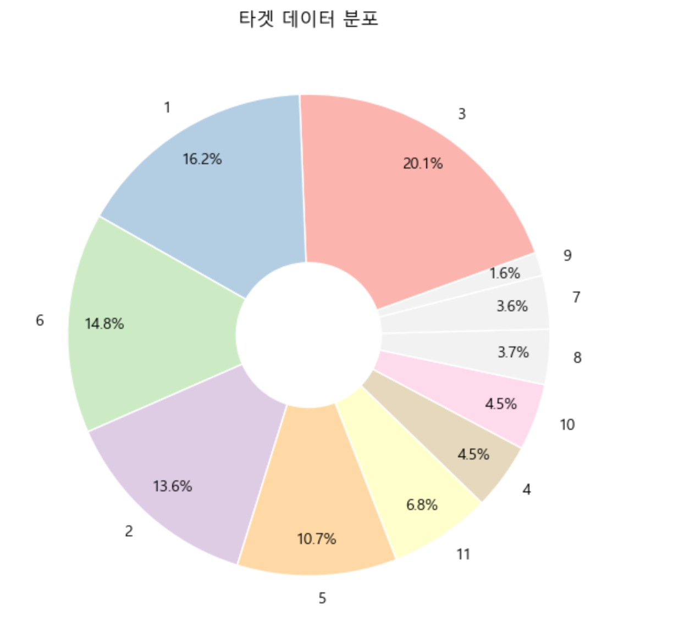</td>
    <td style="text-align: center; vertical-align: middle;">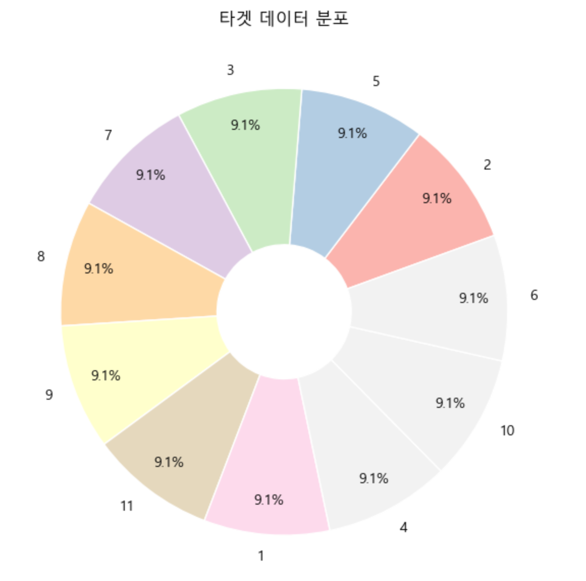</td>
  </tr>
</table>


<br></br>
<br></br>
<br></br>

## □ 사전 모델 학습 (1Cycle)
○ 데이터 세트 분리
- ```scikit-learn(sklearn)``` 라이브러리의 모델의 ```train_test_split```를 통해 데이터 세트를 분리함

<details>
  <summary>code</summary>

  ```
  from sklearn.model_selection import train_test_split

  # 데이터 세트 분리
  # 피처, 타겟 데이터 분리
  features, targets = pre_club_df.features, pre_club_df.targets

  X_train, X_test, y_train, y_test = \
  train_test_split(features, targets, stratify=targets, random_state=124)

  # 검증용 데이터 세트 분리
  X_val_train, X_val_test, y_val_train, y_val_test = \
  train_test_split(X_train, y_train, stratify=y_train, test_size=0.2, random_state=124)
  ```
</details>

<br></br>

○ 모델 훈련
- ```scikit-learn(sklearn)``` 라이브러리의 모델을 통해 학습을 진행함
- ```CountVectorizer```를 통해 텍스트를 숫자 벡터로 변환하고  
```MultinomialNB``` 텍스트의 클래스(카테고리)를 예측하는 분류기를 통해 모임의 카테고리를 예측함
- 두 모델은 ```Pipeline```으로 연결하여 ```GridSearchCV``` 트리 모델(교차 검증)을 통해 훈련 진행

<details>
  <summary>code</summary>

  ```
  from sklearn.model_selection import GridSearchCV
  from sklearn.feature_extraction.text import CountVectorizer
  from sklearn.naive_bayes import MultinomialNB
  from sklearn.pipeline import Pipeline

  parameters = {
      'count_vectorizer__ngram_range': [
          (1, 1), (2, 2), (2, 3), (3, 4), (4, 5)
      ], 
      'multinomial_NB__alpha': [
          0.1, 0.5, 1, 5
      ]   
  }

  m_nb_pipe = Pipeline([('count_vectorizer', CountVectorizer()), 
                        ('multinomial_NB', MultinomialNB())])

  te_m_nb = GridSearchCV(
    m_nb_pipe, param_grid=parameters, cv=10, refit=True, return_train_score=True, n_jobs=-1)

  te_m_nb.fit(X_train, y_train)
  ```
</details>

<br></br>

○ 훈련 결과 확인
- 교차 검증으로 얻은 모든 점수와 관련된 자세한 정보를 ```cv_results_```통해 확인
- 테스트 세트의 평균 점수와 테스트 점수의 순위를 확인함

| index | params                                                                 | mean_test_score | rank_test_score |
|-------|------------------------------------------------------------------------|-----------------|-----------------|
| 0     | {'count_vectorizer__ngram_range': (1, 1), 'multinomialnb__alpha': 0.1} | 0.968792        | 7               |
| 1     | {'count_vectorizer__ngram_range': (1, 1), 'multinomialnb__alpha': 0.5} | 0.949370        | 11              |
| 2     | {'count_vectorizer__ngram_range': (1, 1), 'multinomialnb__alpha': 1.0} | 0.939367        | 14              |
| 3     | {'count_vectorizer__ngram_range': (1, 1), 'multinomialnb__alpha': 5.0} | 0.906404        | 18              |
| 4     | {'count_vectorizer__ngram_range': (2, 2), 'multinomialnb__alpha': 0.1} | 0.974675        | 5               |
| 5     | {'count_vectorizer__ngram_range': (2, 2), 'multinomialnb__alpha': 0.5} | 0.948782        | 12              |
| 6     | {'count_vectorizer__ngram_range': (2, 2), 'multinomialnb__alpha': 1.0} | 0.936415        | 16              |
| 7     | {'count_vectorizer__ngram_range': (2, 2), 'multinomialnb__alpha': 5.0} | 0.905225        | 19              |
| 8     | {'count_vectorizer__ngram_range': (2, 3), 'multinomialnb__alpha': 0.1} | 0.978214        | 3               |
| 9     | {'count_vectorizer__ngram_range': (2, 3), 'multinomialnb__alpha': 0.5} | 0.954079        | 10              |
| 10    | {'count_vectorizer__ngram_range': (2, 3), 'multinomialnb__alpha': 1.0} | 0.941124        | 13              |
| 11    | {'count_vectorizer__ngram_range': (2, 3), 'multinomialnb__alpha': 5.0} | 0.902283        | 20              |
| 12    | {'count_vectorizer__ngram_range': (3, 4), 'multinomialnb__alpha': 0.1} | 0.983512        | 2               |
| 13    | {'count_vectorizer__ngram_range': (3, 4), 'multinomialnb__alpha': 0.5} | 0.967034        | 8               |
| 14    | {'count_vectorizer__ngram_range': (3, 4), 'multinomialnb__alpha': 1.0} | 0.954671        | 9               |
| 15    | {'count_vectorizer__ngram_range': (3, 4), 'multinomialnb__alpha': 5.0} | 0.906989        | 17              |
| 16    | {'count_vectorizer__ngram_range': (4, 5), 'multinomialnb__alpha': 0.1} | 0.991758        | 1               |
| 17    | {'count_vectorizer__ngram_range': (4, 5), 'multinomialnb__alpha': 0.5} | 0.977626        | 4               |
| 18    | {'count_vectorizer__ngram_range': (4, 5), 'multinomialnb__alpha': 1.0} | 0.969979        | 6               |
| 19    | {'count_vectorizer__ngram_range': (4, 5), 'multinomialnb__alpha': 5.0} | 0.938194        | 15              |


<details>
  <summary>code</summary>

  ```
  # 훈련 결과 확인
  result_df = pd.DataFrame(te_m_nb.cv_results_)[['params', 'mean_test_score', 'rank_test_score']]
  result_df
  ```
</details>

<br></br>

○ 예측
- ```best_estimator_```로 최적의 파라미터 값의 모델을 저장 후 ```predict```로 예측 진행

<details>
  <summary>code</summary>

  ```
  te_m_nb = te_m_nb.best_estimator_

  prediction = te_m_nb.predict(X_test)
  ```
</details>

<br></br>
<br></br>
<br></br>

## □ 사전 모델 평가 (1Cycle)
○ 평가
- 오차행렬을 확인하여 예측 결과를 확인함
- 전체적인 수치가 거의 1에 가깝게 나타남에 따라 과적합이 의심되므로 모델 테스트를 진행하기로 함

| 연번 | 지표  | 점수     |
|----|-----|--------|
| 1  | 정확도 | 0.9912 |
| 2  | 정밀도 | 0.9912 |
| 3 | 재현율 | 0.9912 |
| 4 | F1  | 0.9912 |

<br>

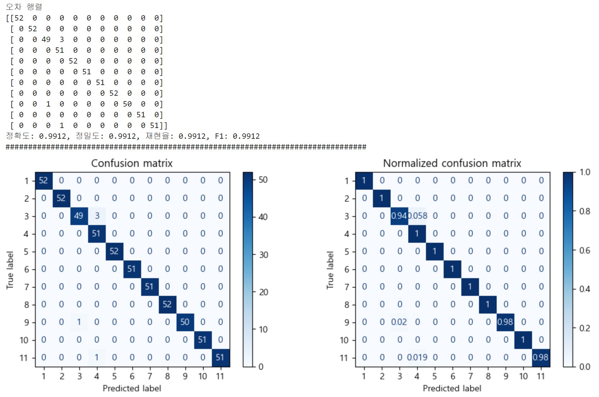


<details>
  <summary>평가 지표 code</summary>

  ```
  import matplotlib.pyplot as plt
  from sklearn.metrics import accuracy_score, precision_score, recall_score, f1_score, roc_auc_score, confusion_matrix, ConfusionMatrixDisplay

  # 정밀도, 재현율, F1 score는 다중 분류에서 각각의 확률값의 평균을 구해서 나타내야 한다.
  # 이 때, macro 방식과, micro 방식이 대표적이다.
  # macro: 평균을 낸 뒤, 그 평균의 다시 평균을 구하는 방식(샘플 수는 신경쓰지 않는다).
  # micro: 샘플 수를 전체 합하고 전체 개수도 전체 합해서 나눠주는 방식(샘플 수를 신경쓴다).
  # 타겟 데이터의 비중이 많이 차이난다면, micro방식을 사용하는 것이 바람직하다.
  def get_evaluation(y_test, prediction, classifier=None, X_test=None):
  #     오차 행렬
      confusion = confusion_matrix(y_test, prediction)
  #     정확도
      accuracy = accuracy_score(y_test , prediction)
  #     정밀도
      precision = precision_score(y_test , prediction, average='micro')
  #     재현율
      recall = recall_score(y_test , prediction, average='micro')
  #     F1 score
      f1 = f1_score(y_test, prediction, average='micro')
      
      print('오차 행렬')
      print(confusion)
      print('정확도: {0:.4f}, 정밀도: {1:.4f}, 재현율: {2:.4f}, F1: {3:.4f}'.format(accuracy, precision, recall, f1))
      print("#" * 80)
      
      if classifier is not None and  X_test is not None:
          fig, axes = plt.subplots(nrows=1, ncols=2, figsize=(12,4))
          titles_options = [("Confusion matrix", None), ("Normalized confusion matrix", "true")]

          for (title, normalize), ax in zip(titles_options, axes.flatten()):
              disp = ConfusionMatrixDisplay.from_estimator(classifier, X_test, y_test, ax=ax, cmap=plt.cm.Blues, normalize=normalize)
              disp.ax_.set_title(title)
          plt.show()

  get_evaluation(y_test, prediction, te_m_nb, X_test)
  ```
</details>

<br></br>

○ 모델 테스트
- ```MultinomialNB```에서 ```predict_proba``` 메서드를 사용하여 각 카테고리에 속할 확률을 확인함
- 여름 시즌에 맞는 '여행 동행 바다 산 여름 시원한' 키워드를 사용하여 진행함

<br>

- '여행 동행 바다 산 여름 시원한' 키워드에 맞는 여행·동행 카테고리를 예측해야 하나 관련 없는 카테고리가 예측된 것을 확인함
- 테스트 결과 모든 확률이 거의 동일하게 나타남에 따라 키워드에 따른 카테고리 분류를 제대로 찾지 못한다는 것을 확인함.
- 결과값이 16등인 {'count_vectorizer__ngram_range': (2, 2), 'multinomial_NB__alpha': 1} 파라미터 값을 사용하여 과적합을 해소하고자 함


| 연번 | 카테고리명   | 확률     |
|----|---------|--------|
| 1  | 취미      | 0.0906 |
| 2  | 문화·예술   | 0.0906 |
| 3 | 운동·액티비티 | 0.0906 |
| 4 | 푸드·드링크  | 0.0912 |
| 5 | 여행·동행   | 0.0906 |
| 6 | 성장·자기개발 | 0.0912 |
| 7 | 동네·또래   | 0.0912 |
| 8 | 연애·소개팅  | 0.0906 |
| 9 | 재테크     | 0.0912 |
| 10 | 외국어     | 0.0912 |
| 11 | 스터디     | 0.0906 |

<br></br>
<br></br>
<br></br>

## □ 사전 모델 학습 (2Cycle)
○ 모델 훈련
- ```GridSearchCV``` 파라미터 값을 조정하여 재훈련함
- 결과값이 16등인 {'count_vectorizer__ngram_range': (2, 2), 'multinomial_NB__alpha': 1} 파라미터 값을 사용

<details>
  <summary>code</summary>

  ```
  from sklearn.model_selection import GridSearchCV
  from sklearn.feature_extraction.text import CountVectorizer
  from sklearn.naive_bayes import MultinomialNB
  from sklearn.pipeline import Pipeline

  parameters = {
      'count_vectorizer__ngram_range': [
          (2, 2)
      ], 
      'multinomial_NB__alpha': [
          1
      ]   
  }

  m_nb_pipe = Pipeline([('count_vectorizer', CountVectorizer()), 
                        ('multinomial_NB', MultinomialNB())])

  te_m_nb = GridSearchCV(
      m_nb_pipe, param_grid=parameters, cv=10, refit=True, return_train_score=True, n_jobs=-1)

  te_m_nb.fit(X_train, y_train)
  ```
</details>

<br></br>

○ 예측
- ```predict```로 예측 진행

<details>
  <summary>code</summary>

  ```
  prediction = te_m_nb.predict(X_test)
  ```
</details>

<br></br>
<br></br>
<br></br>

## □ 사전 모델 평가 (2Cycle)
○ 평가
- 오차행렬을 확인하여 예측 결과를 확인함
- 이전보다는 성능 수치가 하락한 것을 확인할 수 있었음.
- 추가 테스트를 진행하여 각 카테고리에 속할 확률을 확인하기로 함

| 연번 | 지표  | 점수     |
|----|-----|--------|
| 1  | 정확도 | 0.9242 |
| 2  | 정밀도 | 0.9242 |
| 3 | 재현율 | 0.9242 |
| 4 | F1  | 0.9242 |

<br>

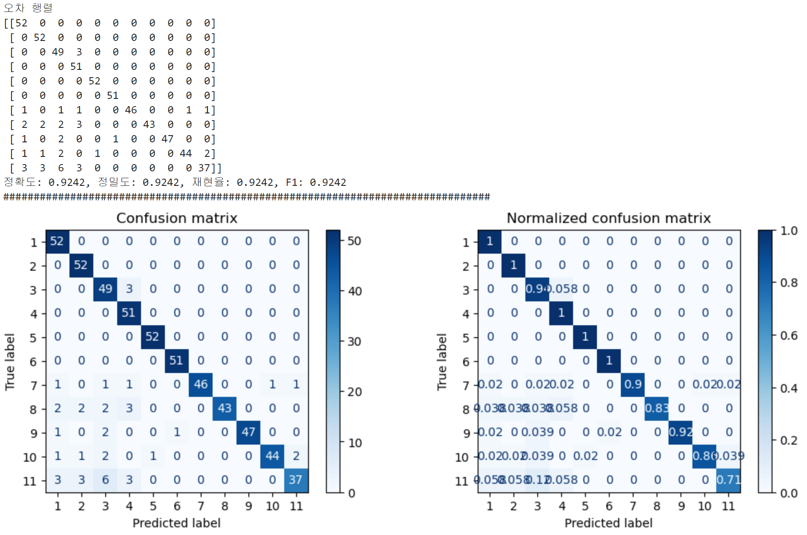


<details>
  <summary>평가 지표 code</summary>

  ```
  import matplotlib.pyplot as plt
  from sklearn.metrics import accuracy_score, precision_score, recall_score, f1_score, roc_auc_score, confusion_matrix, ConfusionMatrixDisplay

  # 정밀도, 재현율, F1 score는 다중 분류에서 각각의 확률값의 평균을 구해서 나타내야 한다.
  # 이 때, macro 방식과, micro 방식이 대표적이다.
  # macro: 평균을 낸 뒤, 그 평균의 다시 평균을 구하는 방식(샘플 수는 신경쓰지 않는다).
  # micro: 샘플 수를 전체 합하고 전체 개수도 전체 합해서 나눠주는 방식(샘플 수를 신경쓴다).
  # 타겟 데이터의 비중이 많이 차이난다면, micro방식을 사용하는 것이 바람직하다.
  def get_evaluation(y_test, prediction, classifier=None, X_test=None):
  #     오차 행렬
      confusion = confusion_matrix(y_test, prediction)
  #     정확도
      accuracy = accuracy_score(y_test , prediction)
  #     정밀도
      precision = precision_score(y_test , prediction, average='micro')
  #     재현율
      recall = recall_score(y_test , prediction, average='micro')
  #     F1 score
      f1 = f1_score(y_test, prediction, average='micro')
      
      print('오차 행렬')
      print(confusion)
      print('정확도: {0:.4f}, 정밀도: {1:.4f}, 재현율: {2:.4f}, F1: {3:.4f}'.format(accuracy, precision, recall, f1))
      print("#" * 80)
      
      if classifier is not None and  X_test is not None:
          fig, axes = plt.subplots(nrows=1, ncols=2, figsize=(12,4))
          titles_options = [("Confusion matrix", None), ("Normalized confusion matrix", "true")]

          for (title, normalize), ax in zip(titles_options, axes.flatten()):
              disp = ConfusionMatrixDisplay.from_estimator(classifier, X_test, y_test, ax=ax, cmap=plt.cm.Blues, normalize=normalize)
              disp.ax_.set_title(title)
          plt.show()

  get_evaluation(y_test, prediction, te_m_nb, X_test)
  ```
</details>

<br></br>

○ 모델 테스트
- ```MultinomialNB```에서 ```predict_proba``` 메서드를 사용하여 각 카테고리에 속할 확률을 확인함
- 여름 시즌에 맞는 '여행 동행 바다 산 여름 시원한' 키워드를 사용하여 진행함

<br>

- '여행 동행 바다 산 여름 시원한' 키워드에 알맞는 여행·동행 카테고리의 확률이 가장 높은 것으로 나타남
- 파라미터 값 조정하여 훈련한 후 확률을 확인하였을 때, 예측이 더 정확해진 것으르 확인함.
- 모임의 경우 모임명이 불규칙함에 따라 반드시 카테고리 + 키워드의 조합을 통해 정확한 결과를 도출해낼 수 있음

<br>

| 연번 | 카테고리명   | 확률     |
|----|---------|--------|
| 1  | 취미      | 0.0256 |
| 2  | 문화·예술   | 0.0246 |
| 3 | 운동·액티비티 | 0.0248 |
| 4 | 푸드·드링크  | 0.0243 |
| 5 | 여행·동행   | 0.7518 |
| 6 | 성장·자기개발 | 0.0249 |
| 7 | 동네·또래   | 0.0250 |
| 8 | 연애·소개팅  | 0.0245 |
| 9 | 재테크     | 0.0241 |
| 10 | 외국어     | 0.0245 |
| 11 | 스터디     | 0.0251 |

<br>

- 따라서, {'count_vectorizer__ngram_range': (2, 2), 'multinomial_NB__alpha': 1} 의 파라미터 값을 가지고 교차 검증된 ```CountVectorizer``` 및 ```MultinomialNB``` 모델을 채택함

<br></br>
<br></br>
<br></br>

## □ 회원 별 훈련 모델
- 회원 별 모델 생성에 따른 추가 학습 진행
- 사전 훈련 모델을 복사하여, 회원이 모임 상세페이지 접속 시 추가 학습을 진행함

<br></br>

○ 모델 훈련
- 회원이 접속한 모임 상세페이지의 모임명, 모임 활동 지역, 모임소개, 모임정보, 모임 카테고리를 한 문장으로 병합한 뒤, 정규표현식을 사용하여 특수문자 등을 제거함
- 회원 별 사전 훈련 모델을 불러와 ```CountVectorizer```를 통해 텍스트를 숫자 벡터로 변환하고  
```MultinomialNB``` 텍스트의 클래스(카테고리)를 예측하는 분류기를 통해 모임의 카테고리를 예측함

<details>
  <summary>code</summary>

  ```
  class ClubDetailView(View):
    def get(self, request):
      @staticmethod
      def clean_text(text):
          # 문자열로 변환한 후 특수 문자와 줄 바꿈 문자를 제거하고 단일 공백으로 변환하며, 앞뒤 공백을 제거
          return re.sub(r'[^\w\s]+', '', text).replace('\n', '').replace('\r', ' ').strip()

      @staticmethod
      def process_club_data(club):
          # Club 객체의 데이터를 정규 표현식을 사용하여 클린한 후 리스트로 반환
          text = ' '.join(club)
          features = clean_text(text)
          return features

      # club ai 회원 별 학습 로직
      # 회원 정보를 섹션에서 받아 멤버 객체로 생성 (dict 객체)
      member = request.session['member']

      # 회원의 정보를 가져오기 (오브젝트 객체)
      member = Member.enabled_objects.get(id=member.get('id'))

      # 모임의 정보 가져오기 (오브젝트 객체)
      club = Club.enabled_objects.get(id=club_id)

      # 회원의 ai 모델 경로 찾아오기
      member_club_ai_path = member.member_recommended_club_model

      # 회원의 ai 모델 경로를 통해 불러오기 (pkl 파일)
      model = joblib.load(os.path.join(Path(__file__).resolve().parent.parent, member_club_ai_path))

      # 지역 객체 저장
      region = Region.objects.get(id=club.club_region_id)

      # 문제-학습 데이터 (지역, 모임명, 모임소개, 모임정보, 카테고리)
      add_X_trian = [region.region, club.club_name, club.club_intro, club.club_info]
      # 정답-학습 데이터 (카테고리)
      add_y_train = [club.club_main_category.id]

      # 정규표현식 함수를 통해 특수문자 등 제거 gn list로 변환
      add_X_train_clean = [process_club_data(add_X_trian)]

      # 추가적인 훈련 데이터 변환
      additional_X_train_transformed = model.named_steps['count_vectorizer'].transform(add_X_train_clean)
      # 추가 훈련 진행 (카테고리 1부터 11까지 가져오기)
      # partial_fit는 온라인 학습을 지원하는 메서드로, 데이터가 점진적으로 도착할 때마다 모델을 업데이트
      model.named_steps['multinomial_NB'].partial_fit(additional_X_train_transformed, add_y_train, classes=[i for i in range(1, 12)])

      # fit이 완료된 모델을 다시 같은 경로에 같은 이름으로 내보내줍니다.
      joblib.dump(model, member.member_recommended_club_model)
  ```
</details>

<br></br>
<br></br>
<br></br>
<br></br>
<br></br>

<h1 id="Ⅲ. 결과">Ⅲ. 결과</h1>

# 1. AI 모임 추천 서비스 상용화
## □ 비회원 화면
- 사전 훈련 모델 사용
- 비회원인 경우 시즌에 맞게 기획한 카테고리 및 키워드를 통해 예측 수행
- 여름 시즌에 맞는 '여행 동행 바다 산 여름 시원한' 키워드를 사용

<br>

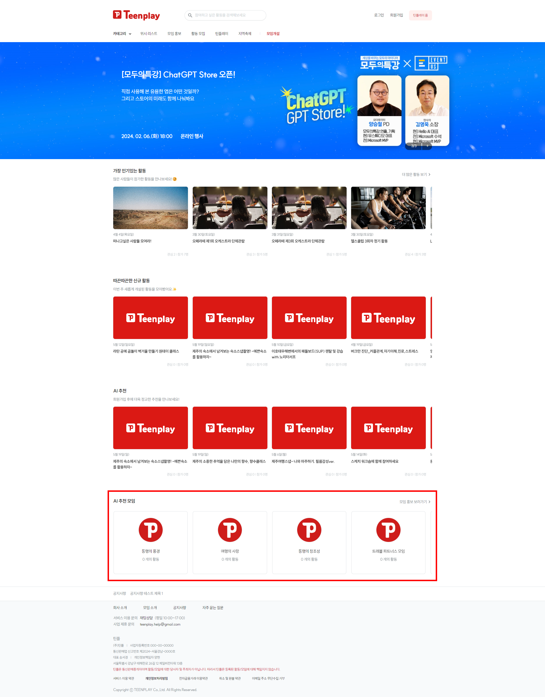

<br>

- 카테고리 비율 확인
- 예측된 상위 1번째 카테고리 모임 6개, 상위 2번째 카테고리 모임 2개로 총 8개 모임을 노출함

<br>

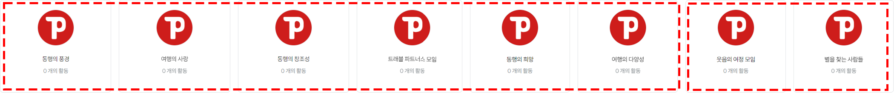

<br></br>

## □ 회원 화면
- 회원 별 훈련 모델 사용

<br>

- 회원이 접속한 모임 상세페이지의 모임명, 모임 활동 지역, 모임소개, 모임정보, 모임 카테고리를 통해 회원 별 추가 학습을 진행함

<br>

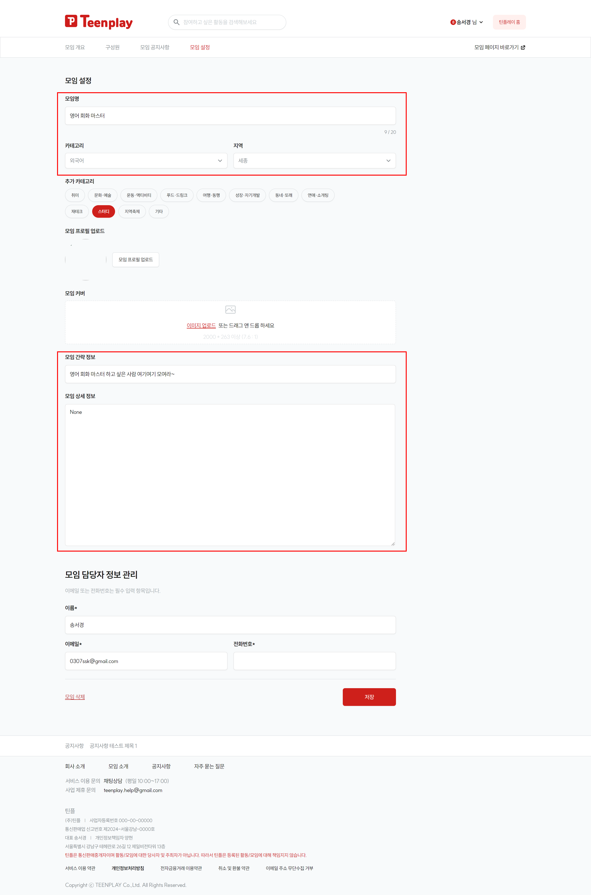

<br>

- 마이페이지 내 정보 수정에서 입력받은 회원의 지역, 관심 카테고리, 관심 키워드 3개를 통해 예측 수행

<br>

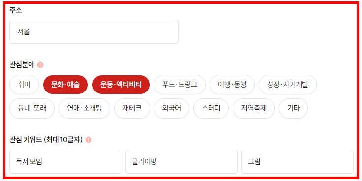

<br>

- 출력 화면

<br>

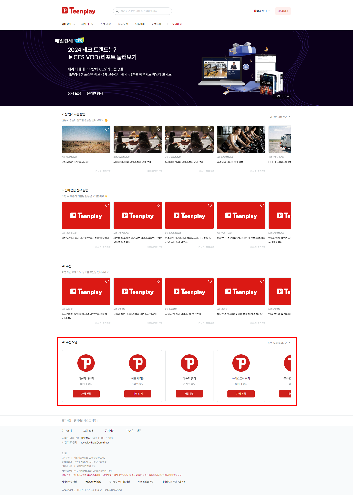

<br>

- 카테고리 비율 확인
- 예측된 상위 1번째 카테고리 모임 6개, 상위 2번째 카테고리 모임 2개로 총 8개 모임을 노출함

<br>

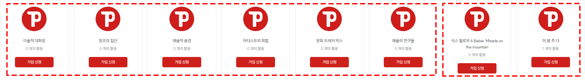

<br></br>
<br></br>

# 2. 트러블 슈팅 및 느낀점
## □ 트러블 슈팅
○ 정규표현식 줄바꿈 문자 노출
- 정규 표현식 적용하였으나 '\r\n' 줄바꿈 문자가 그대로 노출되는 오류가 발생함

```
['서울', '로드 자전거 한', '자전거 타면서 운동하실 분', '오직 자전거를 좋아하는 성인자전거모임\r\n\r\n같이 자전거 타고싶어서 직접만듭니다\r\n자전거 정보같은것도 공유도하고 같이 한강 라이딩\r\n즐겁게 취미로 타실분 모집합니다\r\n\r\n평일주말 저녁 오후에 일주일에 12번 소규모 라이딩 45명으로 탈것같습니다\r\n실력상관없이 즐겁게 같이 타봐요 저도 자린이 입니다\r\n강남구 탄천1교 자전거도로에서 주로 모일것같습니다\r\n코스는 모여서 정할것같아요\r\n\r\n헬멧 전조등 후미등 필수입니다\r\n매너있고 안전하게 같이 라이딩해요']
```

<details>
  <summary>before code</summary>

  ```
  @staticmethod
  def clean_text(text):
      # 문자열로 변환한 후 특수 문자를 제거하는 함수
      return re.sub(r'[^\w\s]', ' ', text)

  @staticmethod
  def process_club_data(club):
      text = ' '.join(club)
      features = clean_text(text)
      return features
  ```
</details>

<br></br>

○ 정규표현식 해결
- ```replace```를 통해  \n와 \r 줄바꿈 문자를 ' ' 단일 공백으로 변환하여 문제를 해결함

```
서울 로드 자전거 한 자전거 타면서 운동하실 분 오직 자전거를 좋아하는 성인자전거모임  같이 자전거 타고싶어서 직접만듭니다 자전거 정보같은것도 공유도하고 같이 한강 라이딩 즐겁게 취미로 타실분 모집합니다  평일주말 저녁 오후에 일주일에 12번 소규모 라이딩 45명으로 탈것같습니다 실력상관없이 즐겁게 같이 타봐요 저도 자린이 입니다 강남구 탄천1교 자전거도로에서 주로 모일것같습니다 코스는 모여서 정할것같아요  헬멧 전조등 후미등 필수입니다 매너있고 안전하게 같이 라이딩해요
```

<details>
  <summary>after code</summary>

  ```
  @staticmethod
  def clean_text(text):
      # 문자열로 변환한 후 특수 문자와 줄 바꿈 문자를 제거하고 단일 공백으로 변환하며, 앞뒤 공백을 제거
      return re.sub(r'[^\w\s]+', '', text).replace('\n', '').replace('\r', ' ').strip()
  ```
</details>

<br></br>

○ **[FileNotFoundError]** plk 파일 로드 오류
- 오류 메세지
```
FileNotFoundError: [Errno 2] No such file or directory: 'C:\\study\\teenplay_server\\ai\\ai/2024/05/22/club_model18.pkl'
```

<details>
  <summary>before code</summary>
  ```
  model = joblib.load(os.path.join(Path(__file__).resolve().parent, member_club_ai_path))
  ```
</details>

<br>

- pkl 파일 불러오기 시 파일 경로를 제대로 찾지 못하는 오류인 것으로 나타남
- 경로 확인해보면 \\ (역슬래시)와 / (슬래시)가 혼용되고 있음
- 문제 해결을 위해 인터넷을 찾아보니 ```Path(__file__).resolve().parent``` 스크립트 파일이 있는 디렉토리에서 해당 파일을 찾으려고 시도 중인것으로 나타남
- ```Path(__file__).resolve().parent.parent``` parent를 두개 붙여주면 스크립트 파일이 있는 디렉토리의 상위 디렉토리로 이동하기 때문에 경로를 제대로 찾을 수 있는 것으로 확인함

<br></br>

○ **[FileNotFoundError]** plk 파일 로드 오류 해결
- 즉, 파일의 위치가 더 상위 디렉토리에 있거나 다른 위치에 있다면 ```.parent.parent``` 옵션을 사용

<details>
  <summary>after code</summary>

  ```
  model = joblib.load(os.path.join(Path(__file__).resolve().parent.parent, member_club_ai_path))
  ```
</details>

<br></br>

○ **[ValueError]** targets 데이터 불러오기 오류 
- 오류 메세지
```
  ValueError: The type of target data is not known
```

<details>
  <summary>before code</summary>

  ```
  class AiTests(TestCase):
    member = Member.enabled_objects.get(id=18)

    # 회원의 ai 모델 경로 찾아오기
    member_club_ai_path = member.member_recommended_club_model

    # 회원의 ai 모델 경로를 통해 불러오기 (pkl 파일)
    model = joblib.load(os.path.join(Path(__file__).resolve().parent.parent, member_club_ai_path))

    club = Club.enabled_objects.get(id=4)

    region = Region.objects.get(id=club.club_region_id)

    # 문제-학습 데이터 (지역, 모임명, 모임소개, 모임정보, 카테고리)
    add_X_trian = [region.region, club.club_name, club.club_intro, club.club_info]
    # 정답-학습 데이터 (카테고리)
    add_y_train = [club.club_main_category]

    # 정규표현식 함수를 통해 특수문자 등 제거 후 list로 변환
    add_X_train_clean = [process_club_data(add_X_trian)]

    # 훈련 결과 확인
    result_df = pd.DataFrame(model.cv_results_)[['params', 'mean_test_score', 'rank_test_score']]

    model = model.best_estimator_

    additional_X_train_transformed = model.named_steps['count_vectorizer'].transform(add_X_train_clean)
    model.named_steps['multinomial_NB'].partial_fit(additional_X_train_transformed, add_y_train, classes=[i for i in range(1, 12)])
  ```

</details>

<br>

- 타겟 데이터의 유형을 명확이 할 수 없다고 나타남에 따라 타겟 데이터가 어떻게 출력되는지 확인
- 확인 결과 타겟 데이터는 오브젝트 객체로 나타나고 있었음

```
  [<Category: Category object (3)>]
```

<details>
  <summary>code</summary>

  ```
      add_y_train = [club.club_main_category]
      print(add_y_train)
  ```

</details>

<br>

- 객체의 값을 가져와야 하기 때문에 .id 라는 속성을 붙여 정확한 객체의 값을 가져오기
- 수정 후 실행한 결과 오류가 없이 정상 작동하는 것을 확인함

```
  [3]
```

<details>
  <summary>after code</summary>

  ```
  add_y_train = [club.club_main_category.id]
  ```
</details>


<br></br>

## □ 느낀점
- 실무와 유사한 프로젝트를 진행하며 실무 지식과 기술을 습득할 수 있었습니다.  
웹 개발에 이어 머신러닝(분류 및 회귀)을 학습하고 각 프로젝트를 진행하며, 웹과 ai 서비스를 어떻게 접목할 수 있을지 궁금했습니다.  
훈련된 ai 모델을 pkl 파일로 내보내고 불러오는 프로세스를 통해 상용화가 가능하게 됐고 데이터를 받아 모델의 추가 학습도 가능하다는 것을 보며, 실무에서도 해당 프로세스 대로 적용할 수 있다는 것을 알 수 있었습니다.  
실무에 필요한 실질적인 지식과 기술을 습득하며 성장할 수 있는 시간이 되어 매우 의미있게 다가왔습니다.

<br>

- 이번 팀 프로젝트를 진행하며 다시 한번 팀원과의 소통의 중요성을 느꼈습니다.  
단순히 각자 파트를 분배하여 모델을 개발하는 것이 끝이 아닌 상용화 과정에서 예측 값 같은 디테일에 대해 논의해야 하는 부분이 있었고  
서로의 ai 모델을 병합하는 과정에서 충돌되지 않기 위해 잦은 소통이 필요했습니다. 
서로 간의 소통이 부족했으면 충돌 등으로 인해 문제 해결이 지체되었을 텐데 원활한 소통을 통해 무사히 마무리하며 다시 한번 소통의 중요성을 느낄 수 있었습니다.

<br></br>
<br></br>

# 3. 개선사항
○ 사전 훈련 모델 예측 키워드 유지보수
- 현재는 관리자가 유지보수를 위해 시즌별 키워드를 직접 입력할 수 있도록 구현됨
- 앞으로의 개선을 위해 회의를 통해 정기적인 시즌 키워드 도출하고 자동으로 호출할 수 있도록 구현할 예정
